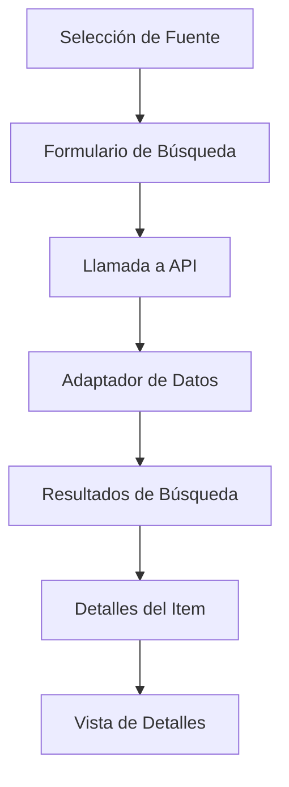

# 🎬 Buscador Peliculas y Anime

<div align="center">
  
  
  
  
</div>

<div align="center">
  <h3>🚀 Buscador Universal de Películas y Anime</h3>
  <p>Una aplicación moderna construida con Vue 3, Vuetify y Vite que integra múltiples APIs para buscar películas y anime.</p>
</div>

<div align="center">
  
  
  
  
</div>

---

## ✨ Características

### 🎯 Funcionalidades Principales

- **Búsqueda Múltiple**: Integra 3 APIs diferentes para una experiencia completa
- **Interfaz Moderna**: Diseño responsive con Material Design 3
- **Detalles Completos**: Información detallada con reparto, calificaciones y sinopsis
- **Navegación Intuitiva**: Flujo de usuario optimizado con navegación por pasos

### 🔍 Fuentes de Datos

- **🎬 TMDB (The Movie Database)**: Películas en español con información completa del reparto
- **🎭 OMDb (Open Movie Database)**: Películas en inglés con múltiples calificaciones
- **🎌 Jikan (MyAnimeList)**: Anime con personajes y seiyuus

### 🛠️ Tecnologías

- **Frontend**: Vue 3 con Composition API
- **UI Framework**: Vuetify 3 (Material Design 3)
- **Build Tool**: Vite
- **Package Manager**: pnpm
- **HTTP Client**: Fetch API nativo

---

## 🚀 Instalación y Configuración

### 📋 Prerrequisitos

```bash
Node.js >= 16.0.0
pnpm >= 7.0.0
```

### 🔧 Configuración del Proyecto

1. **Clonar el repositorio**

```bash
git clone https://github.com/SaKio1985/Buscador-peliculas.git
cd Buscador-peliculas
```

2. **Instalar dependencias**

```bash
pnpm install
```

3. **Configurar variables de entorno**

```bash
# Crear archivo .env en la raíz del proyecto
cp .env.example .env
```

4. **Añadir las API Keys al archivo .env**

```env
VITE_OMDB_API_KEY=tu_omdb_api_key
VITE_TMDB_API_KEY=tu_tmdb_bearer_token
```

### 🔑 Obtener API Keys

#### TMDB API

1. Registrarse en [The Movie Database](https://www.themoviedb.org/)
2. Ir a Configuración → API
3. Copiar el "Bearer Token" (no la API Key)

#### OMDb API

1. Registrarse en [OMDb API](http://www.omdbapi.com/)
2. Obtener la API Key gratuita
3. Copiar la clave proporcionada

> **Nota**: Jikan API no requiere autenticación

---

## 🎮 Uso

### 🏃‍♂️ Desarrollo

```bash
# Ejecutar servidor de desarrollo
pnpm dev

# La aplicación estará disponible en http://localhost:5173
```

### 🏗️ Producción

```bash
# Construir para producción
pnpm build

# Previsualizar build de producción
pnpm preview
```

---

## 🏗️ Arquitectura del Proyecto

```
src/
├── components/           # Componentes Vue reutilizables
├── services/            # Servicios de API y adaptadores
│   ├── omdb.js         # Servicio OMDb API
│   ├── tmdb.js         # Servicio TMDB API
│   ├── jikan.js        # Servicio Jikan API
│   └── dataAdapter.js  # Adaptador de datos unificado
├── plugins/            # Configuración de plugins
│   └── vuetify.js      # Configuración Vuetify
├── App.vue             # Componente principal
└── main.js             # Punto de entrada
```

### 🔄 Flujo de Datos



---

## 🎨 Interfaz de Usuario

### 🖼️ Capturas de Pantalla

<div align="center">
  
  
  
    
      
</div>

### 📱 Responsive Design

- **Desktop**: Experiencia completa con layout de 3 columnas
- **Tablet**: Diseño adaptativo con 2 columnas
- **Mobile**: Interfaz optimizada para una sola columna

---

## 🔧 Configuración Avanzada

### 🎨 Personalización de Tema

```javascript
// src/plugins/vuetify.js
import { createVuetify } from 'vuetify'

export default createVuetify({
  theme: {
    defaultTheme: 'dark',
    themes: {
      dark: {
        colors: {
          primary: '#1976D2',
          secondary: '#424242',
          accent: '#82B1FF',
          error: '#FF5252',
          info: '#2196F3',
          success: '#4CAF50',
          warning: '#FFC107',
        },
      },
    },
  },
})
```

### 🔌 Añadir Nuevas APIs

1. **Crear servicio de API**

```javascript
// src/services/nueva-api.js
export const searchNuevaAPI = async (query) => {
  // Implementar lógica de búsqueda
}

export const getNuevaAPIDetails = async (id) => {
  // Implementar lógica de detalles
}
```

2. **Actualizar adaptador de datos**

```javascript
// src/services/dataAdapter.js
export const adaptSearchResults = (results, apiSource) => {
  switch (apiSource) {
    case 'nueva-api':
      return results.map((item) => ({
        // Mapear propiedades
      }))
    // ... otros cases
  }
}
```

---

## 📊 APIs Integradas

### 🎬 TMDB (The Movie Database)

- **Endpoint**: `https://api.themoviedb.org/3`
- **Autenticación**: Bearer Token
- **Funcionalidades**:
  - Búsqueda de películas en español
  - Información detallada con reparto
  - Imágenes de alta calidad

### 🎭 OMDb (Open Movie Database)

- **Endpoint**: `https://www.omdbapi.com`
- **Autenticación**: API Key
- **Funcionalidades**:
  - Búsqueda de películas en inglés
  - Múltiples calificaciones (IMDb, Rotten Tomatoes, etc.)
  - Información básica del reparto

### 🎌 Jikan (MyAnimeList)

- **Endpoint**: `https://api.jikan.moe/v4`
- **Autenticación**: No requerida
- **Funcionalidades**:
  - Búsqueda de anime
  - Información de personajes y seiyuus
  - Calificaciones de MyAnimeList

---

## 🤝 Contribución

### 📝 Guía de Contribución

1. **Fork el proyecto**
2. **Crear rama de feature** (`git checkout -b feature/amazing-feature`)
3. **Commit los cambios** (`git commit -m 'Add some amazing feature'`)
4. **Push a la rama** (`git push origin feature/amazing-feature`)
5. **Abrir Pull Request**

### 🐛 Reportar Bugs

Utiliza el [sistema de issues](https://github.com/SaKio1985/Buscador-peliculas/issues) para reportar bugs. Incluye:

- Descripción del problema
- Pasos para reproducir
- Comportamiento esperado
- Capturas de pantalla (si aplica)

### 💡 Solicitar Features

Las solicitudes de nuevas características son bienvenidas. Abre un issue etiquetado como `enhancement`.

---

## 🚀 Roadmap

### 📅 Próximas Funcionalidades

- [ ] 🔍 Búsqueda avanzada con filtros
- [ ] ⭐ Sistema de favoritos
- [ ] 📱 Aplicación móvil (React Native)
- [ ] 🎨 Temas personalizables
- [ ] 🔄 Sincronización con servicios de streaming
- [ ] 📊 Estadísticas de búsqueda
- [ ] 🌐 Soporte para más idiomas

### 🎯 Versión 2.0

- **Series de TV**: Integración con APIs de series
- **Modo Offline**: Cache local con Service Workers
- **Recomendaciones**: Sistema de recomendaciones basado en ML
- **Social**: Compartir y comentar películas

---

## 🔐 Seguridad

### 🛡️ Mejores Prácticas Implementadas

- **Variables de entorno**: API keys nunca expuestas en el código
- **Sanitización**: Entrada de usuario validada y sanitizada
- **HTTPS**: Todas las llamadas a API utilizan HTTPS
- **CSP**: Content Security Policy configurada

### 🚨 Reportar Vulnerabilidades

Si encuentras una vulnerabilidad de seguridad, por favor crea un issue en el repositorio marcado como "security".

---

## 📈 Performance

### ⚡ Optimizaciones Implementadas

- **Lazy Loading**: Carga diferida de imágenes
- **Code Splitting**: División de código automática con Vite
- **Tree Shaking**: Eliminación de código no utilizado
- **Minificación**: Compresión de assets en producción

### 📊 Métricas

- **First Contentful Paint**: < 1.5s
- **Largest Contentful Paint**: < 2.5s
- **Cumulative Layout Shift**: < 0.1

---

## 📱 Compatibilidad

### 🌐 Navegadores Soportados

- Chrome 90+
- Firefox 88+
- Safari 14+
- Edge 90+

### 📱 Dispositivos

- **Desktop**: Windows, macOS, Linux
- **Mobile**: iOS Safari, Android Chrome
- **Tablet**: iPad, Android tablets

---

## 🧪 Testing

### 🔧 Configuración de Tests

```bash
# Ejecutar tests unitarios
pnpm test

# Ejecutar tests con coverage
pnpm test:coverage

# Ejecutar tests e2e
pnpm test:e2e
```

### 📊 Coverage

Objetivo: Mantener > 80% de cobertura de código

---

## 📚 Documentación

### 📖 Recursos Adicionales

- [Documentación de Vue 3](https://vuejs.org/)
- [Documentación de Vuetify 3](https://vuetifyjs.com/)
- [Guía de Vite](https://vitejs.dev/)

### 🎓 Tutoriales

- [Cómo integrar una nueva API](#-añadir-nuevas-apis)
- [Personalización de temas](#-personalización-de-tema)

---

## 📄 Licencia

Este proyecto está licenciado bajo la Licencia MIT - ver el archivo [LICENSE](LICENSE) para más detalles.

---

## 🙏 Agradecimientos

- **Vue.js Team** por el increíble framework
- **Vuetify Team** por los componentes Material Design
- **TMDB** por proporcionar la API de películas
- **OMDb** por la base de datos de películas
- **Jikan** por la API de anime

---

## 👨‍💻 Autor

**Iban Dorado**

- GitHub: [@SaKio1985](https://github.com/SaKio1985)
- LinkedIn: [Iban Dorado](https://www.linkedin.com/in/iban-dorado-171a4a24b)

---

## 🌟 ¿Te gustó el proyecto?

Si este proyecto te fue útil, por favor considera:

- ⭐ Dar una estrella al repositorio
- 🍴 Hacer un fork para contribuir
- 📢 Compartir con otros desarrolladores

<div align="center">
  <h3>¡Gracias por usar Buscador Peliculas y Anime 🎬</h3>
</div>
